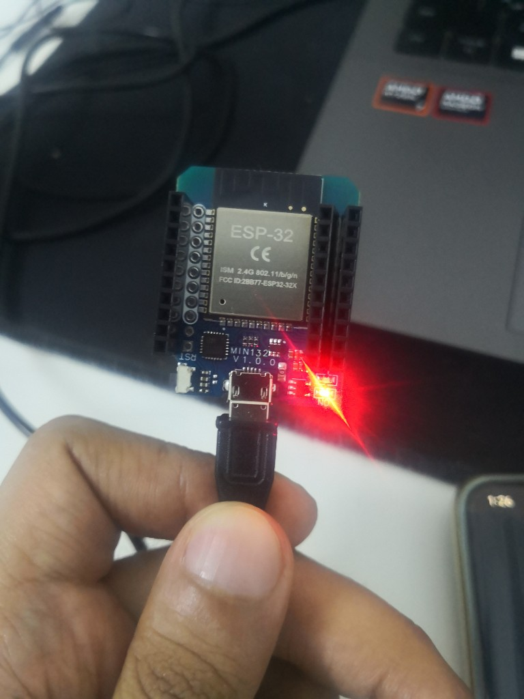

<div align="center">

# Web Control Panel for RoboDog

**لوحة تحكم ويب + ESP32 — Smart Methods Internship**

[](https://webtask1.free.je/h/)
[](https://webtask1.free.je/h/manual.html)
[](https://webtask1.free.je/h/voice.html)

**[HZCS-IoT](https://github.com/HZCS-IoT)** · Web & Applications Track

</div>

---

## Overview | نظرة عامة

مشروع **Robot Dog** يجمع بين تطبيق ويب ولوحة ESP32:

| Task | What it does | Status |
|------|--------------|--------|
| **Task 2** | لوحة تحكم (يدوي + صوت) → حفظ الأوامر في MySQL | Done |
| **Task 1** | ESP32 يقرأ آخر أمر عبر HTTP GET كل ثوانٍ | Done |

**الفكرة باختصار:** تضغط زر أو تتكلم → الأمر يُحفظ في قاعدة البيانات → ESP32 يقرأه وينفّذه (لاحقاً عبر Arduino Uno للمحركات).

---

## Demo Videos | فيديوهات العرض

| | الوصف | الرابط |
|---|--------|--------|
| 🎤 | **Voice Control** — تحكم بالصوت من اللابتوب | [youtu.be/Qn9NiOmC40Q](https://youtu.be/Qn9NiOmC40Q) |
| 📱 | **Manual Control** — تحكم من الجوال (Short) | [youtube.com/shorts/7RdiBsMd9t4](https://youtube.com/shorts/7RdiBsMd9t4) |
| 🎬 | Demo كامل (Task 2) | [youtu.be/-kLJGbAwb0M](https://youtu.be/-kLJGbAwb0M) |

---

## Live Demo | جرّب الآن

| Page | URL |
|------|-----|
| Home | [webtask1.free.je/h/](https://webtask1.free.je/h/) |
| Manual | [webtask1.free.je/h/manual.html](https://webtask1.free.je/h/manual.html) |
| Voice | [webtask1.free.je/h/voice.html](https://webtask1.free.je/h/voice.html) |

---

## System Architecture | هيكل النظام

```
┌─────────────────────────────────────────────────────────┐
│  Browser (Phone / Laptop)                               │
│  manual.html  ·  voice.html                             │
└────────────────────────┬────────────────────────────────┘
                         │  POST
                         ▼
┌─────────────────────────────────────────────────────────┐
│  PHP Backend                                            │
│  update_command.php  ·  save_speech.php  ·  get_state.php│
└────────────────────────┬────────────────────────────────┘
                         │
                         ▼
┌─────────────────────────────────────────────────────────┐
│  MySQL — robot_state · speech_logs                      │
└────────────────────────┬────────────────────────────────┘
                         │  HTTP GET (every 2–3 sec)
                         ▼
┌─────────────────────────────────────────────────────────┐
│  ESP32 (WEMOS D1 MINI)  →  Arduino Uno  →  Robot Dog   │
└─────────────────────────────────────────────────────────┘
```

---

## Hardware | العتاد

<p align="center">
  
</p>

<p align="center"><em>ESP32 — WEMOS D1 MINI · Task 1 HTTP Client</em></p>

| Component | Role |
|-----------|------|
| **ESP32** | WiFi + HTTP GET → reads `command` from server |
| **Arduino Uno** | Motor control (future — physical robot build) |
| **XAMPP (local)** | Apache + MySQL for ESP32 testing on same WiFi |
| **InfinityFree** | Hosted web app (HTTPS) for manual + voice demo |

---

## Features | المميزات

- **Manual control** — forward, backward, left, right, stop, sit
- **Voice control** — Speech to Text (Arabic / English)
- **Database** — commands in `robot_state`, speech in `speech_logs`
- **ESP32 polling** — reads latest command via `get_state.php`
- **Modern UI** — dark theme, mobile-friendly

---

## Commands | الأوامر

| Action | Arabic | English | DB |
|--------|--------|---------|-----|
| Forward | للأمام / قدام | forward | `f` |
| Backward | للخلف / ورا | backward | `b` |
| Left | يسار | left | `l` |
| Right | يمين | right | `r` |
| Stop | قف / توقف | stop | `S` |
| Sit | اجلس | sit | `j` |

> **Voice tip:** Use **Arabic mode** for Arabic commands, **English mode** for forward/backward. Voice on phone requires **HTTPS** (InfinityFree or `localhost` on laptop).

---

## Project Structure

```
Web-ControlPanel-for-RoboDog/
├── index.html              # Home
├── manual.html             # Manual control pad
├── voice.html              # Voice control (Speech to Text)
├── css/  js/
├── update_command.php      # Save command → DB
├── get_state.php           # Read command ← ESP32
├── save_speech.php         # Save speech text
├── setup.sql
├── db.example.php          # Copy to db.php (never commit db.php)
├── docs/images/
│   └── esp32-board.png     # Hardware photo
└── esp32/
    └── task1_http_client/  # ESP32 Arduino sketch
```

---

## Quick Start

### Web (InfinityFree)

1. Run `setup.sql` in phpMyAdmin
2. Copy `db.example.php` → `db.php` and add your credentials
3. Upload files to `htdocs/h/`

### ESP32 (Local XAMPP)

1. Install **XAMPP** — start Apache + MySQL
2. Copy web files to `C:\xampp\htdocs\h\`
3. Open `esp32/task1_http_client/task1_http_client.ino`
4. Set `WIFI_SSID`, `WIFI_PASS`, and your PC IP in `SERVER_URL`
5. Upload to **ESP32 Dev Module** · Serial Monitor **115200**
6. Open `http://YOUR_PC_IP/h/manual.html` from phone (same WiFi)
7. Press a button → Serial Monitor shows `>>> NEW COMMAND: f (forward)`

> **Note:** InfinityFree blocks direct ESP32 requests (JavaScript challenge). Use **local XAMPP** for Task 1.

---

## Tech Stack

| Layer | Technology |
|-------|------------|
| Frontend | HTML · CSS · JavaScript |
| Backend | PHP |
| Database | MySQL |
| Speech | Web Speech API (Chrome / Edge) |
| IoT | ESP32 · Arduino IDE |
| Hosting | InfinityFree + XAMPP (local) |

---

## Team

<div align="center">

**[HZCS-IoT](https://github.com/HZCS-IoT)**

Smart Methods · Internship · Web & Applications Track

---

🎤 [Voice Demo](https://youtu.be/Qn9NiOmC40Q) · 📱 [Mobile Short](https://youtube.com/shorts/7RdiBsMd9t4) · 🏠 [Live Site](https://webtask1.free.je/h/)

</div>
